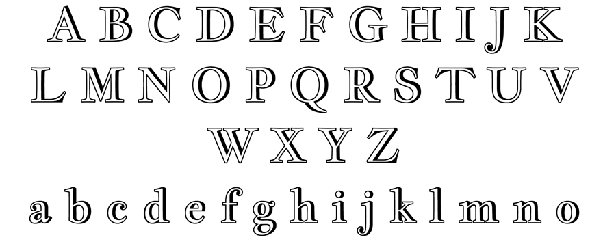

Jacques Francois Shadow is an incised variant of 
[Jacques Francois font](cyrealtype/Jacques-Francois)

Its letterforms are related to the Enschedé no. 811 type specimen
by J. F. Rosart. Compared to the historic specimen the x-height 
is generously increased and contrast lowered.

Jacques Francois is a Unicode typeface family that supports 
languages that use the Latin script and its variants, and 
could be expanded to support other scripts. is designed for large sizes 
and manually instructed for better screen performance starting
from 24 ppem. This means that on Window machines it 
will work best from 18 pt(@96ppi) or 15 pt(@120ppi),
and from 24 pt on Mac(@72ppi).

Jacques Francois Shadow is a Unicode typeface family that supports 
languages that use the Latin script and its variants, and 
could be expanded to support other scripts.

